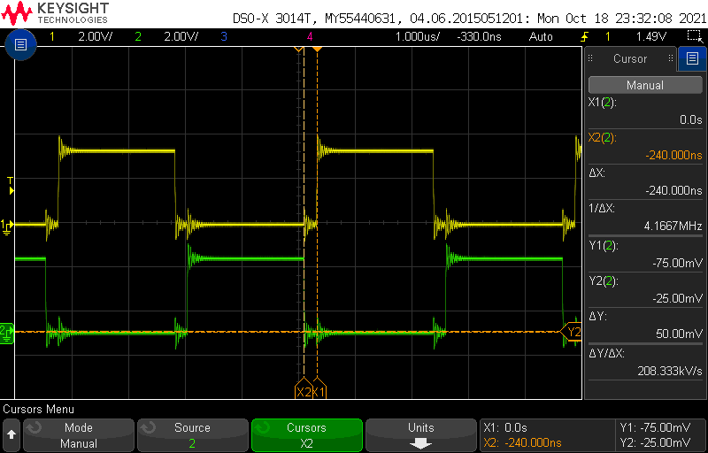
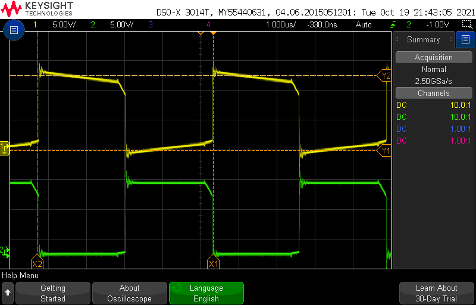
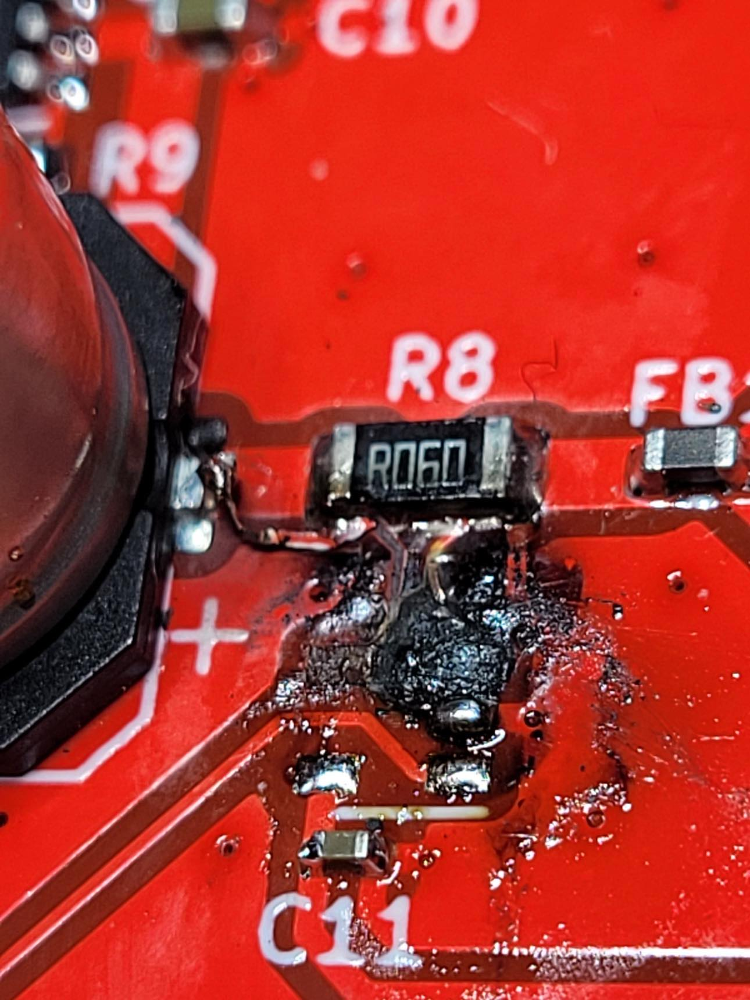
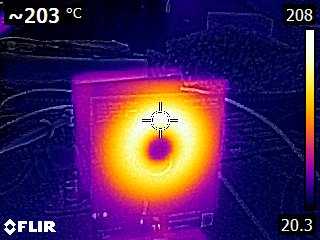
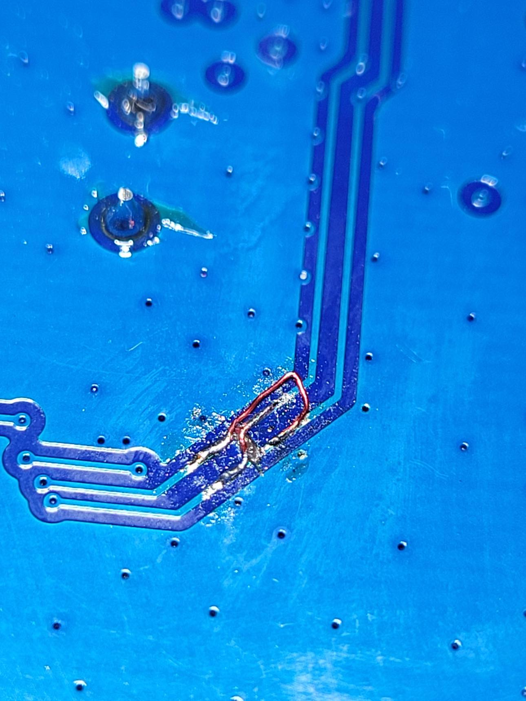

# PCB Trace-based Wireless Power Transfer

### Motivation
For whatever reason, I find Christmas to be a source of inspiration for personal projects. Since 2019 I had been toying with the idea of making a [persistence of vision](https://www.youtube.com/watch?v=JrcKJOdjQN8) Christmas tree, where LEDs along the edge of a tree-shaped PCB would carve out a 3D tree shape that could also display text or animations. I have the unfortunate tendency to overcomplicate personal projects, and thinking through the project requirements I decided that using either a slip ring or having separate power supplies for the spinning and stationary portions of the device would be inelegant, despite this being how basically every hobbyist POV display is implemented. Instead I chose to use wireless power transfer. However, in my continuing effort to make the project even more complicated, I decided I didn't want to use an off-the-shelf Qi charging system, and instead wanted to roll my own wireless power transfer system, using coils constructed from PCB traces. 

Ultimately, I realized that this was a terrible idea ([hover for spoilers](./ "PCB trace DCR is much higher than Qi coils")), but I had a lot of fun along the way, and did in fact manage to get the wireless power link up and running.

<video width="360" height="640" controls>
  <source src="../../assets/test_with_scope.mp4" type="video/mp4">
</video> 
 

### The Load

Before designing the actual power transfer portion, I first had to decide what the system would actually be powering. Since the eventual goal was to build a persistence of vision display, this would essentially serve as a platform board with LEDs, shift registers to drive them, a hall sensor, and a microcontroller to manage the system. For fun, I also included a temperature sensor (so this could also serve as a room thermometer) and a current sense amplifier, for power diagnostics.
I wanted to start building something that could display text, so I settled on a 5x8 array of LEDs (5x8 is used on lots of LCDs, and can support most characters). Based on my expected max currents, I came up with a very generous power budget of around 400mA.
For the microcontroller, I selected the STM32G031C6 - I happened to have some on hand, and this part met all of my requirements (IO count, I2C, ADC).

### The Wireless Link
To keep life simple, I decided to keep my coil turns ratio as 1:1. Additionally, from reading a few papers on the topic, I decided to use series-series resonant matching, as the resonant would have the least variance in response to system parameters (since the reflected load impedance in this configuration does not include a frequency-dependent element). My primary concern during the design phase was that low coil coupling would make it difficult for me to get enough power to the load, so I opted for a full-bridge driver (class D) on the TX side, to double my drive voltage. On the RX side, I included a full-bridge rectifier feeding directly into a wide-input (4.4-50V) buck converter down to 3.3V (the level required by the STM32). 

Calculating the expected inductance of the PCB coils was a very imprecise endeavor. I originally used some online calculators to come up with an initial target of 22uH, but the real value I ended up with was around 52uH (with a DCR of 3 ohms). 

### The Coil Driver

Doing a few rounds of LTspice simulations helped uncover some critical issues before I actually committed to the design:
1. In my simulations I was getting huge current spikes (110A at initial turn-on, and 4A recurring) in the low-side FETs. I eventually tracked this down to excessively fast charging of the bootstrap caps, where adding a 10 ohm resistor reduced that initial spike to 1.1A and the recurring spikes to 600mA.
2. Shoot-through was a major risk that could easily blow up my FETs. To mitigate this I used gate drivers, and also planned for a drive waveform with deadtime inserted between the negative and positive phases of the switching cycle. This was a major deciding factor in my decision for the coil driver to use a STM32F070F6 - the advanced timer already had the ability to generate complementary PWM outputs with inserted deadtime.

To round out the design, I used the same 3.3V output buck as the receiver side to generate the supply rail needed for the microcontroller. The system is powered from 12V, to give a 24V swing across the resonant tank, and also because I happened to have some 12V power supplies from past projects.

### The Good
At a high-level, everything worked! 
* The STM32F070F6 produced the exact drive signals I wanted (albeit with some ringing, waveform below)

* Full-bridge driver drove the tank circuit without exploding (bridge outputs shown below)

* RX board was able to power on, show some patterns on the LEDs, and read all of the sensors
* Most importantly, the wireless link worked robustly, and was able to supply sufficient power to the RX side even with around 5cm of air gap (better than I was expecting). Approxiate range test shown below.

<video width="640" height="360" controls>
  <source src="../../assets/range_test.mp4" type="video/mp4">
</video> 
 

### The Bad
There were two massive issues with this design
1. Circuit behavior resonance is hard to accurately simulate and predict since it is depends so heavily on real-world parameters (component variations, parasitics, load variations, distance and orientation of coils, etc.) During some of my initial testing, at one point I brought the coils very close together and several components on the board failed simultaneously. I had a suspicion that the current-sense amp was the root cause, based on the fact that it looked like this:

After assembling a second board without the current sense amp, I was able to measure the voltage coming out of the rectifier, which logged over 60V. From my simulations I was only expecting around 20V at the output of the bridge rectifier. Needless to say, my RX parts were not rated for 70V. In particular, the current sense amp common-mode voltage rating was only 26V. Unsurprisingly, this part failed catastrophically, and appears to have shorted the MCU to input power as well.

2. PCB traces (at least at 1oz copper) have much higher DCR than a commercial Qi-coil made of Litz wire (3 ohms vs ~500mOhm). Additionally, I was often testing at slightly greater distances than Qi would use, decreasing the coil coupling and requiring ever more current at the TX side. The combination of these factors meant that I was dissipating a lot of heat in the TX coil. How much, you ask? Based on FLIR captures, at an input power of 1.6A, my coil was hitting peak temperatures above 200°C  (compared to only 37°C in the RX coil). Unfortunately I couldn't calculate efficiency due to issue 1.

This is way above the typical ~130°C for FR4 glass transition temperature, so I imagine that if I left the board running for any significant duration, the coil would likely start to warp and delaminate. 

### The Ugly
Some issues I identified n addition to my exploding current-sense amplifier and overheating TX coil:
* The buck converter and associated caps are also not rated for 70V. An easier (if inelegant) solution would be to include a physical spacer on the RX coil to prevent the two coils from coming close enough to cause the tank voltage to reach unsafe levels. But this would require careful empirical testing with many units.
* I forgot to swap the high and low inputs between the two gate drivers, which required reworking the traces
  

### The End
Overall I was very happy that I was able to get the wireless power transfer (the main aim of this project) working relatively well. However, due primarily to the coil heating issue, this ultimately proved to be impractical for the overall goal of making a POV Christmas Tree, which I eventually dropped as a project. If I went back to attempt this project again, I think I would just use a slip ring, or at least a Qi-charging setup.
For what it's worth, Sean Hodgins [ended up making one](https://www.youtube.com/watch?v=-R5Wl697IuM) (though on a much larger scale than I had ever planned).
