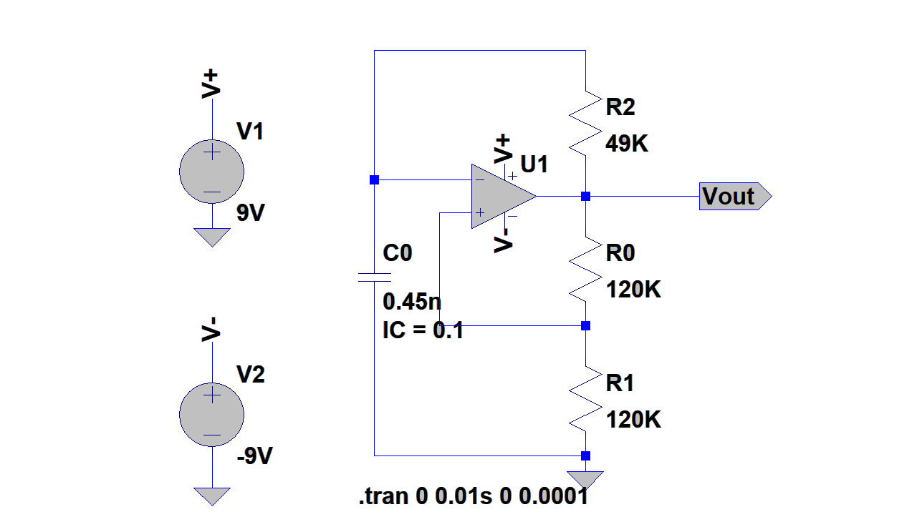
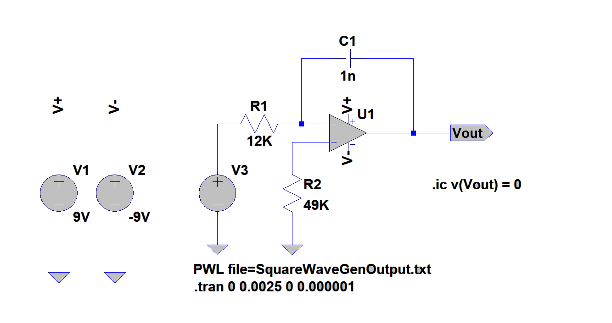
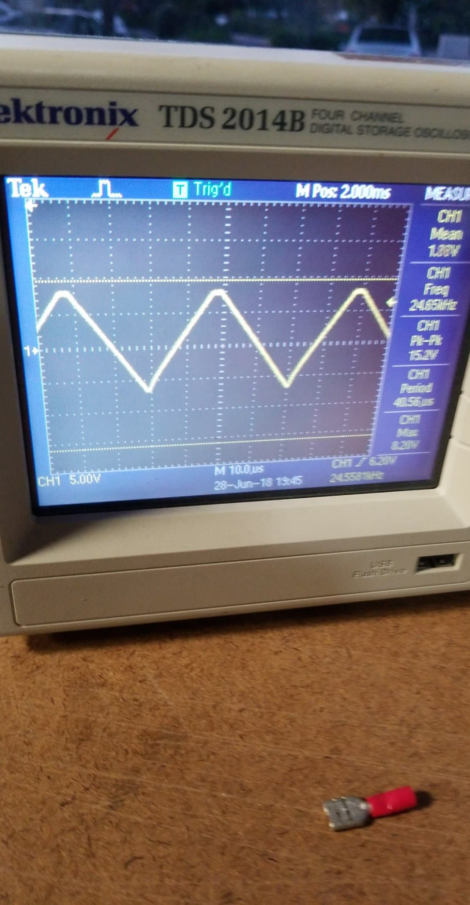
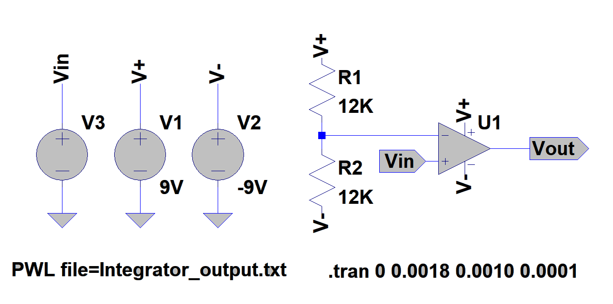
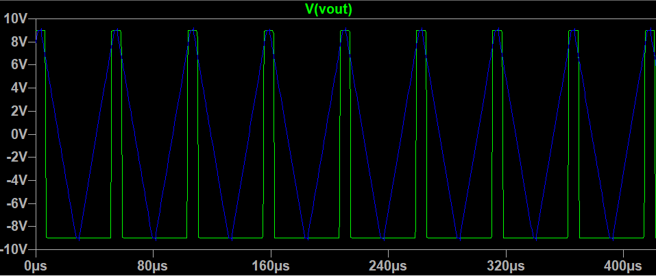
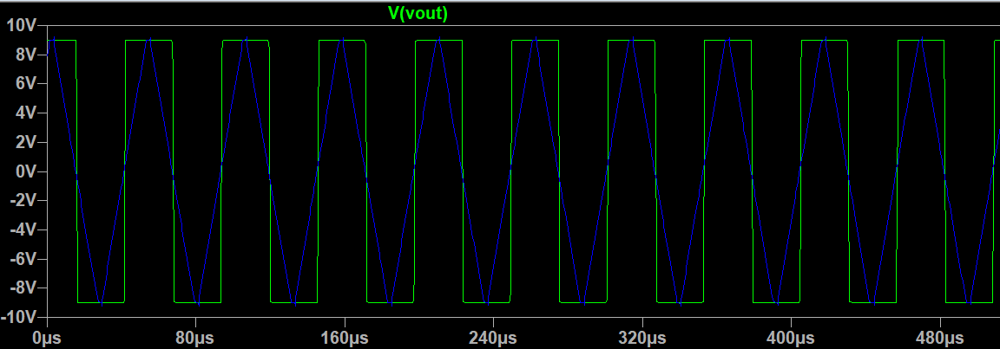
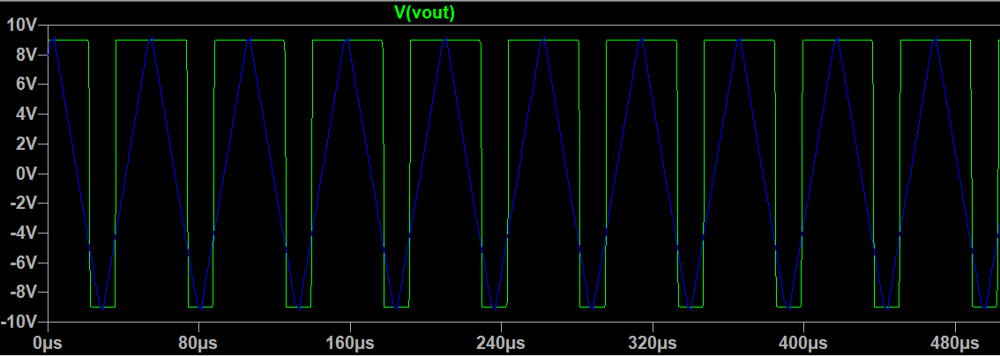

# Analog PWM generator

### Motivation

Over the course of ELE302 (popularly known at Princeton as Car lab), I discovered that breathing solder smoke for any period of times made me prone to headaches (read: *not good*). My immediate solution was to buy a PC fan on [amazon](https://www.amazon.com/gp/product/B01J76IYL4/ref=oh_aui_detailpage_o07_s00?ie=UTF8&psc=1 "in case you want one"). After googling the PC fan PWM control spec, I plugged the fan into a function generator + power supply, and happily continued soldering.

Of course, a function generator isn't something that I'll always have on hand, and I was curious about how I could go about generating a control signal without lugging around bench equipment everywhere. The classic solution, it would seem, is to just use a 555 timer. However, the results aren't super accurate, and that's also just boring. Instead, I decided to make an adjustable PWM generator with 3 stages of ICs.

### Square waves (an astable multivibrator)

This was actually the circuit that first convinced me that circuits were in fact useful. It was a problem on a final exam I took, and I remember walking out after the exam, being amazed that a circuit had done something other than just change the amplitude of a sine wave. 

The principle of operation is fairly simple. The op amp is set up as a comparator, where the inputs are an RC circuit and a voltage divider. Both the voltage divider and the RC circuit are connected to Vout, thus the capacitor voltage wants to charge/discharge towards Vout, and the voltage divider gives some value between 0 and Vout. When the capacitor passes the value set by the divider, Vout will invert, and the cycle begins again. Because the RC charging takes a consistent amount of time (assuming equal supply rails, and adequate time), Vout will alternate between high and low at a constant frequency, otherwise known as a square wave.

As an aside, this square wave generator was one of my first encounters with non-ideal components. I first built it using the UA471, and found that my square wave generator was in fact producing triangle waves. At first, I was willing to just move on to the third stage, thinking that I had just stumbled into a happy accidental solution. It technically worked in driving the fan, but I found that the peak amplitude of the square wave wasn’t at all stable, which made it completely unsuitable for generating a consistent duty cycle for the PWM signal.

After thinking about the problem and reading the datasheet, I read that the slew rate of the UA741 is 0.5V/µs. In case you aren’t familiar with the term (I wasn’t), slew refers to the rate at which an amplifier can “track” an abrupt change in input. 
Given that I needed to generate a PWM signal of 20 kHz, this gave me a half-period of 25µs. Going from approximately -7.5V to 7.5V, the op amp would take 30µs just to reach the new voltage! This explained my weirdly clipped triangle output. The next day, I dropped by the local electronics store and picked up some LM318 high speed op-amps, which have a typical slew rate of 70V/µs. The resultant waveform was a nice, clean square wave :)

### Integrator

The theory behind the integrator stage is fairly simple mathematically. There are a couple ways to think about it, but this is the way that makes the most sense to me.
First off, the current through R1 is fairly obvious, as it’s just Vin/12K. Taking the assumption that no current flows into the input of the op-amp, all current through R1 must also flow through C1. Since we have a virtual ground at the inverting input, we can define current through C1 as C * dVout/dt. Thus Vin/R1 = -C1 * dVout/dt. Vout = 1/RC * integral of Vin dt. Voila! Integration! If we simply consider this for a constant Vin (considering the square wave as piecewise DC chunk), we get that Vout = -t/RC. Thus our square wave will instead generate ramps, and if the period is short enough, we’ll just get triangle waves!

### Basic comparator

The math behind the comparator is pretty trivial, so I’ll skip it. Just note that the comparator, coupled with the triangle wave, will basically take the peaks of the positive triangles, and turn those into rectangular pulses. Or, finally, PWM signals! Thus the duty cycle directly correlates to the reference voltage of the comparator.

    <figure>
      
      <figcaption>12.5% duty cycle</figcaption>
    </figure>
    <figure>
      
      <figcaption>50% duty cycle</figcaption>
    </figure>
    <figure>
      
      <figcaption>75% duty cycle</figcaption>
    </figure>

### Putting it all together

While this of course uses more components (and more math) than a simple PWM signal generated from a 555 timer, I personally have found it to be more useful, as the duty cycle and frequency can be easily adjusted with just potentiometers, and I (hopefully) actually understand what’s going on!

<video width="320" controls muted>
  <source src="../../assets/fan_pwm_circuit.mp4" type="video/mp4">
Your browser does not support the video tag.
</video> 

There are a few issues I hope to address in the future, namely the fact that there appears to be a minimum/maximum duty cycle before the output simply is low or high. I suspect this may have something to do with the fact that the op-amps are not rail-to-rail. The PWM edge also has some non-ideal settling that may be due to stray capacitance, so I plan to move this project onto a higher quality breadboard, or possibly perfboard. Overall however, this drives the fan as desired, so I'm satisfied. 

### Lessons learned

* On an exam, you can probably assume your op-amp is ideal (tbt ELE203). In practice, you cannot.
* Don't just prop up fast components. Especially cheap ones. They will fall, and they will break.
* Sometimes, ICs will blow up. And sometimes, you'll never know why. Wear safety glasses kids.
* It's a good idea to define initial constraints in LTSpice
* LTSpice can export a waveform as text, but to import it back into LTSpice as PWL, you need to manually remove the header -_-
