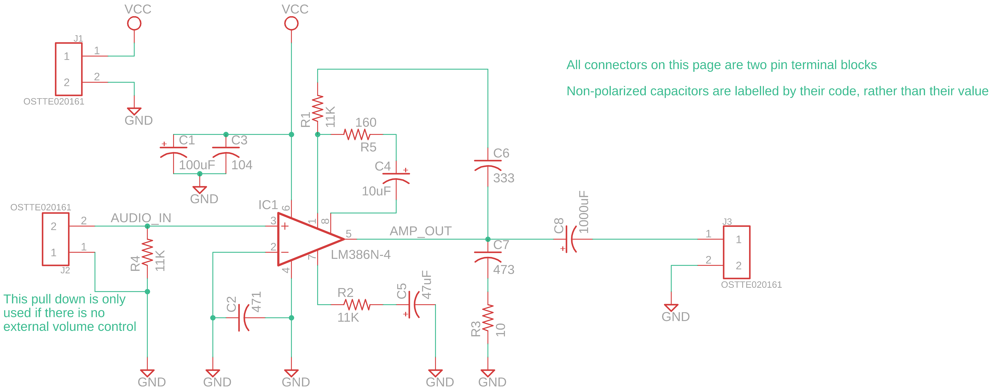

# A Basic Boombox

### Motivation 

Over the course of Princeton's junior EE design course, I found myself experimenting with audio circuits. Specifically, I was trying to use microphones to pick up the sound of a drone (worked surprisingly poorly). When that failed, I tried to generate a loud squeal that could be picked up by the mic. (For reference, my partner and I decided to do a drone following platform as our independent project). 

Along the way, I found myself using the vaunted LM386, an audio amplifying IC. Heading into the summer, I wanted to work with this chip some more, and decided that building a boombox might be a good use of the chip. Along the way, I did some other cool things too (designing my first personal PCBs, developing a volume control board, making a laser cut enclosure). Here's the end product!

<video width="320" height="240" controls>
  <source src="../../assets/boombox_feeling_good.mp4" type="video/mp4">
Your browser does not support the video tag.
</video>   
 

### The Audio Amp

The LM386 is a class A/B amplifier, which gives it pretty minimal distortion (not that I know enough about audio to tell). It’s a finnicky, temperamental chip, but it can produce surprisingly clean (and extremely loud) audio if the right components are used. For much of my initial experimentation with this chip, I thought that my choice of components was the reason for the distorted, noisy audio signals I was hearing. However, I figured out that the issues I was facing could really be narrowed down to two sources: using cheap breadboards, and power supply noise. The cheap breadboards were easily addressed, but the power supply noise is something I still haven’t fully conquered: it’s not apparent when audio is playing, but when nothing is plugged in there’s an audible hum. 

Anyways, here’s a breakdown of what the different accompanying parts are for:
* C1 and C3 are power supply decoupling caps. The 0.1uF is pretty standard, the 100uF I found to work best just be trying different values. YMMV. 
* C2 is included to bypass noise to ground, though I didn’t personally notice much of a performance effect. 
* R2 and C5 compose a bypass circuit that will additionally help to filter power supply noise before it reaches the IC input stages. 
* R5 and C4 set the gain of the circuit to 100. I originally was hoping to use the max gain of 200, but found that the power supply noise was getting amplified too much. 100 was a decent compromise between volume and noise, especially given the logarithmic nature of human hearing.
* C7 and R3 form a low pass filter, but as you might notice, the corner frequency for this is ~340 KHz, far above the range of human hearing, and thus anything we might input to this circuit. While I didn’t notice any performance different with these present, supposedly it can help to suppress oscillations at higher frequencies (the configuration is known as a snubber). 
* R1 and C6 are used for a bass boost. In the [schematic]( http://www.ti.com/lit/ds/symlink/lm386.pdf), there’s an internal 15kΩ feedback resistor between Pin 1 and the output. R1 and C6 bridge the same gap, and at high frequencies, the parallel resistance is ~6kΩ. Thus the (negative) feedback current is actually greater at higher frequencies, which will suppress higher frequencies. Technically, this isn’t boosting the bass so much as it is attenuating higher frequencies.
* Finally, R4 is a pull-down resistor for if no input signal is present (I left this unstuffed), and C8 is the output coupling capacitor. The output of the LM386 is biased at VCC/2, so it has to be brought down to 0 in order to not fry the speaker. I went with 1000 uF because it was the largest cap I had, but the higher the better (realistically, 250 uF should be adequate)
For a much more detailed explanation of how this amp works, [see here]( https://www.electrosmash.com/lm386-analysis)

Here’s the final result!

### The Volume Board

### Laser Cutting the Enclosure

### Lessons Learned
* When working with sensitive analog circuitry, a good breadboard is infinitely better than a cheap one. And a PCB is even better
* Even if you think you've hooked up the wires correctly, check again. I flipped the + and - inputs more times than I can remember
* Buy heatshrink. And put the heatshrink on before you start soldering the wires to things
* When assembling tightly constrained components, think about what you *won't* be able to access afterwards

### Resources
