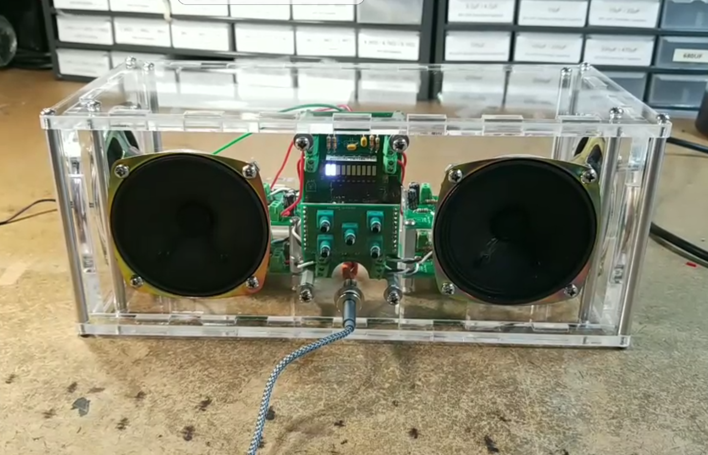
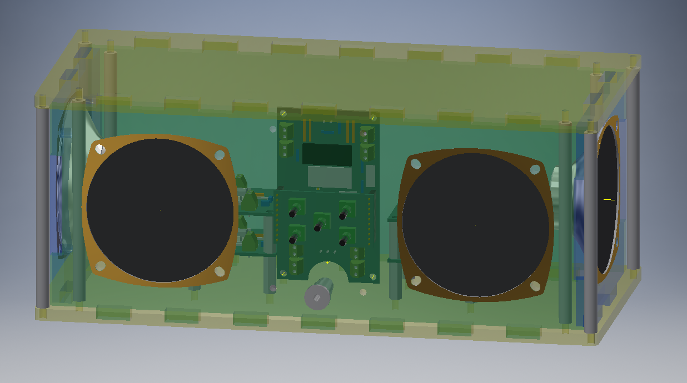

# A Basic Boombox

### Motivation 

Over the course of Princeton's junior EE design course, I found myself experimenting with audio circuits. Specifically, I was trying to use microphones to pick up the sound of a drone (worked surprisingly poorly). When that failed, I tried to generate a loud squeal that could be picked up by the mic. (For reference, my partner and I decided to do a drone following platform as our independent project). 

Along the way, I found myself using the vaunted LM386, an audio amplifying IC. Heading into the summer, I wanted to work with this chip some more, and decided that building a boombox might be a good use of the chip. Along the way, I did some other cool things too (designing my first personal PCBs, developing a volume control board, making a laser cut enclosure). Here's the end product!

<video width="320" height="240" controls>
  <source src="../../assets/boombox_feeling_good.mp4" type="video/mp4">
Your browser does not support the video tag.
</video>   
 

### The Audio Amp

The LM386 is a class A/B amplifier, which gives it pretty minimal distortion (not that I know enough about audio to tell). It’s a finnicky, temperamental chip, but it can produce surprisingly clean (and extremely loud) audio if the right components are used. For much of my initial experimentation with this chip, I thought that my choice of components was the reason for the distorted, noisy audio signals I was hearing. However, I figured out that the issues I was facing could really be narrowed down to two sources: using cheap breadboards, and power supply noise. The cheap breadboards were easily addressed, but the power supply noise is something I still haven’t fully conquered: it’s not apparent when audio is playing, but when nothing is plugged in there’s an audible hum. 

Anyways, here’s a breakdown of what the different accompanying parts are for:
* C1 and C3 are power supply decoupling caps. The 0.1uF is pretty standard, the 100uF I found to work best just be trying different values. YMMV. 
* C2 is included to bypass noise to ground, though I didn’t personally notice much of a performance effect. 
* R2 and C5 compose a bypass circuit that will additionally help to filter power supply noise before it reaches the IC input stages. 
* R5 and C4 set the gain of the circuit to 100. I originally was hoping to use the max gain of 200, but found that the power supply noise was getting amplified too much. 100 was a decent compromise between volume and noise, especially given the logarithmic nature of human hearing.
* C7 and R3 form a low pass filter, but as you might notice, the corner frequency for this is ~340 KHz, far above the range of human hearing, and thus anything we might input to this circuit. While I didn’t notice any performance different with these present, supposedly it can help to suppress oscillations at higher frequencies (the configuration is known as a snubber). 
* R1 and C6 are used for a bass boost. In the [schematic]( http://www.ti.com/lit/ds/symlink/lm386.pdf), there’s an internal 15kΩ feedback resistor between Pin 1 and the output. R1 and C6 bridge the same gap, and at high frequencies, the parallel resistance is ~6kΩ. Thus the (negative) feedback current is actually greater at higher frequencies, which will suppress higher frequencies. Technically, this isn’t boosting the bass so much as it is attenuating higher frequencies.
* Finally, R4 is a pull-down resistor for if no input signal is present (I left this unstuffed), and C8 is the output coupling capacitor. The output of the LM386 is biased at VCC/2, so it has to be brought down to 0 in order to not fry the speaker. I went with 1000 uF because it was the largest cap I had, but the higher the better (realistically, 250 uF should be adequate)
For a much more detailed explanation of how this amp works, [see here]( https://www.electrosmash.com/lm386-analysis)

Here’s the final result!

### The Volume Board

The vertical, central board in the boombox serves a lot of different functions: it controls the outgoing volume to the audio amplifier boards, distributes power through the boombox, and also contains an LED VU meter to indicate approximate volume range to the user. In addition to this, it has two rows of header sockets onto which a smaller button board is mounted. I won't dedicate a section to the button board, since it's literally just 5 buttons and some header pins, but here's a picture of it.

#### Digipots

The button boards are connected to the MAX5456 chip, which is a digital potentiometer actually specifically designed for use with audio. It has a logarithmic taper, as opposed to linear, which means that the volume adjustment is much more intuitive for hearing (human aural volume is sensed logarithmically). In addition, it has a mute button, and balance function (to shift the sound distribution from side-to-side). Unlike many other digipots, the MAX5456 (and 5457) is incremented not through SPI or I2C, but through a push button interface. It even includes automatic debouncing! All around, it's fantastic for volume control applications. 

The MAX5456 is actually the first chip I've had to put on a board without first testing its function (the package is a QSSOP, which I couldn't find a breakout board for). Needless to say, I was extremely excited when it first worked.

<video width="320" height="240" controls>
  <source src="../../assets/VolumeTest.mp4" type="video/mp4">
Your browser does not support the video tag.
</video>   
 

#### VU meter

I knew from the beginning of this project that I wanted some indicator of volume. One naive solution would be to just connect the LM3914 (LED bar graph driver) directly to one of the audio out lines. However this would a) give a wildly variable volume level b) only represent one channel, which would be inaccurate when using the balance function and c) load the audio line, with potential impact on volume/quality. Instead, I added *another* MAX5456 chip, hooked up to the same button controls, and instead fed it a constant voltage level. This way, the output would literally just be voltage divided down, giving a good input to the LED bar graph driver, which is essentially a ladder of comparators. In order to overcome the balance issue, I connected the left and right outputs, which has the effect of averaging the two voltages. This was a somewhat nerve-racking design choice, given that I had only ordered 3 of the chip, but I was able to assemble the board without needing the spare.

One thing I will note is that the LM3914 uses a linear sweep of comparators to determine which LEDs to drive, whereas my volume control unit is logarithmic. This does mean that there isn't a 1-to-1 correspondance between button presses and LED bars lighting up. In future versions, I might basically make my own version of the LM3914, with logarithmic references, but for now I'm satisfied with the outcome. The visible meter is a 10-segment white LED bar graph. For any details about the setup, you can consult the [schematic](insert link to schematic) I made. There were a few last minute adjustments. The 10 uF bulk caps were switched to 4.7uF because those were the largest ceramics I had. I accidentally used the ceramic cap footprint for the 10uF power supply decoupling cap, so I squeezed in an electrolytic instead. Finally, a few of the SMD passives are 0603 packages instead of 0805. You might notice that I have a mix of SMD and THD parts. That's primarily due to part availability. In an ideal world, I'd only use SMD, but since I had to buy each individual SMD valued part I was looking for, and several of my ICs were through hole anyways, I opted to only use SMD for the more sensitive, space-constrained parts (e.g. the audio handling). 

### Laser Cutting the Enclosure
From the beginning of this project, I had already decided that I wanted the project to be visually interesting, and to me, that meant being able to see the internals of the boombox. That immediately narrowed down my options for materials to glass and clear plastic, and acrylic was the obvious winner with respect to cost, ease of fabrication, and material properties. 

In the past, I've tried to make enclosures with 3d printing (which was too slow, prone to errors, and warped when cooling), as well as laser cut plates, hot glued together (had weak joints and poor aesthetics). This time, I decided to make an enclosure that required minimal assembly and would also look good. I chose clear acrylic, and designed an enclosure that conceivably could be held together with a single standoff (though I used 8 for strength and symmetry). 

The first step in my design process was to actually model all of the parts that would be going into the enclosure, as I didn't want to end up with an enclosure that didn't fit all the boards. Some parts, like the momentary buttons, were relatively easy to model, whereas others, like the speakers, were comparatively harder. Thanksfully, Eagle has a new feature that allows exporting boards into Fusion360, from which it was simple to move the models to Inventor. In the past I've tried just guesstimating how big an enclosure needs to be, which inevitably leads to either cramped components or wasted material: having a good 3d model made a world of difference, and I'll definitely go this route in the future. I did a few test cuts on scrap material to check if the parts fit as expected (the speakers in particular I was unsure of), and surprisingly everything checked out! With all parts modelled, designing the enclosure was simply a matter of placing the boards and speakers, figuring out the wall sizes needed, and adding cutouts. The walls of the enclosure are cut to fit into each other, and have tabs on the top and bottom that slot into the corresponding plates. 

 
As a segue, I love laser cutting as a method of producing enclosures/fixtures. While 3d printing allows for complex shapes and minimizes external hardware, laser cutting is orders of magnitude faster, requires no consideration for shrinkage/warping/liftoff/etc. (at least for hobbyist level extruded 3d printers, this has been a consistent problem), and is stunningly accurate. Out of curiosity, I designed my tabs with almost no clearance, and was amazed to find that everything still fit together. Here's a picture of the final assembly in CAD and in reality.

      
      

### Lessons Learned
* When working with sensitive analog circuitry, a good breadboard is infinitely better than a cheap one. And a PCB is even better
* Even if you think you've hooked up the wires correctly, check again. I flipped the + and - inputs more times than I can remember
* Buy heatshrink. And put the heatshrink on before you start soldering the wires to things
* When assembling tightly constrained components, think about what you *won't* be able to access afterwards

### Resources
