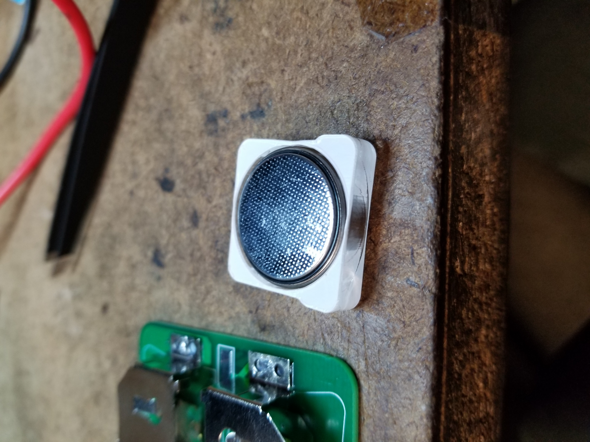
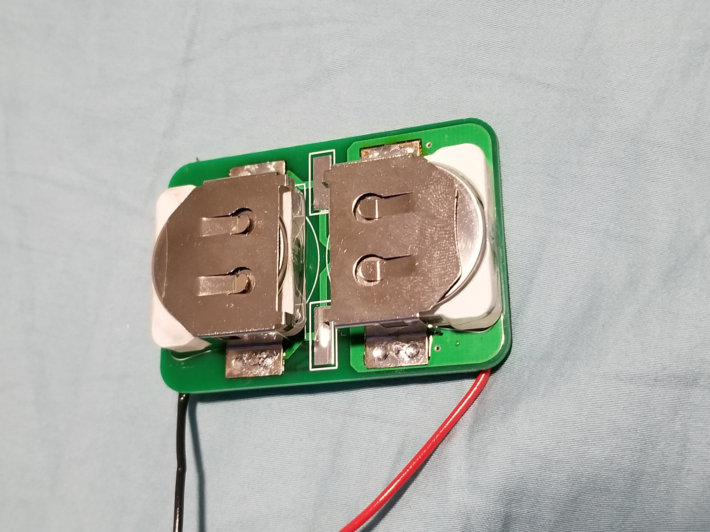
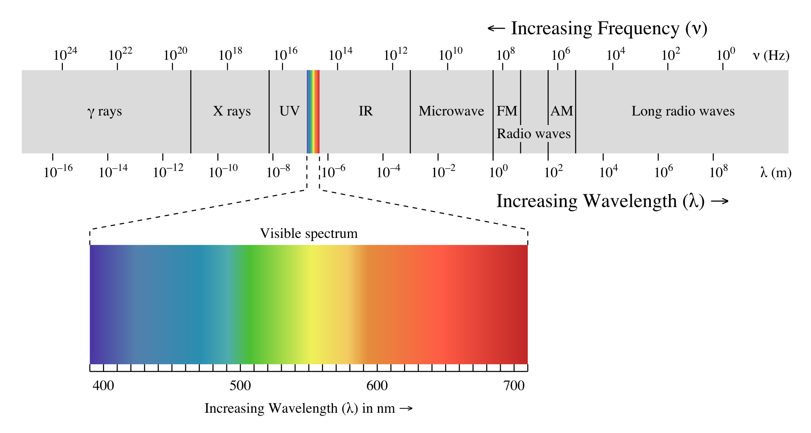
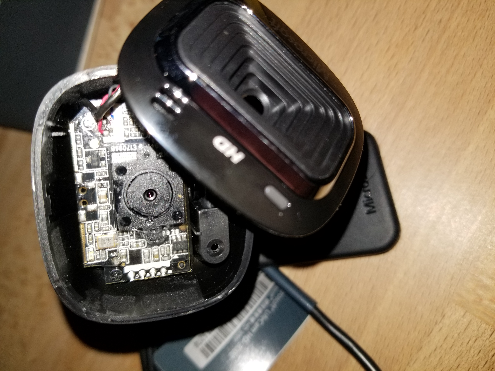
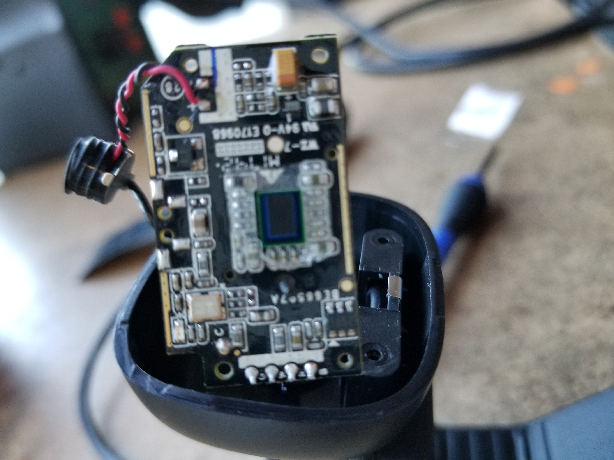
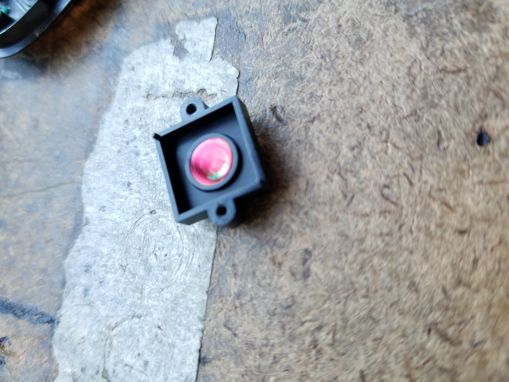
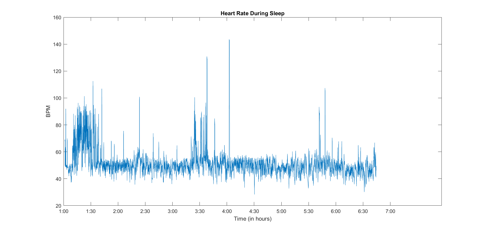

# Heartbeat Sensor

### Motivation

During my sophomore year, I spent a night in the hospital after I passed out from exhaustion/dehydration (oops). During my stay, they had me hooked up to a pulse-ox, which also gave a readout for pulse. This became relevant, because apparently there was a built-in alarm that would go off if a patient's pulse dipped below 45 bpm. Mine did this whenever I started to fall asleep, which was not helpful for the whole exhaustion thing. Since then, I've learned to hydrate properly, but I did have one lingering question.

45 is quite low for heart rate, especially considering I'm not an athlete by any means. I've been wondering since then what my heart rate is like at night, and whether it's *normally* so low.

So of course I built a sensor to track it for me! Because buying a Fitbit would be too easy.

<video width="320" controls muted>
  <source src="../../assets/heartbeat_oscope.mp4" type="video/mp4">
Your browser does not support the video tag.
</video> 

### Overview

The sensor uses a small piezo to detect heart rate when strapped to my finger. It uses two custom PCBs, worn around the wrist. One is used just for batteries. The other collects the voltage from the piezo, does some basic amplification/thresholding, and triggers a high power infrared LED when a pulse is detected. This infrared flash isn't visible to the human eye, so it won't bother me while I'm trying to sleep, but the signal can be picked up by a modified webcam (in the above video, my phone is able to pick up a small amount of IR). Storing 6+ hours of footage and analyzing it manually sounds like an actual punishment, so instead I wrote a basic C++ program using OpenCV to record light intensity in each frame. I then used a combination of C++ and MATLAB to extract pulses from the light intensity data, and plot it across the time I spent asleep.

### Early Design Decisions
The first question I always get whenever I mention this project to anyone is "why not just use an Arduino/microcontroller/Fitbit". As I have to explain every time, this project was intended as a design/learning challenge more than a purely functional device. Of course it would be simple to implement this with an Arduino Nano, but where's the fun in that? Subsequently, I decided to keep all of my circuit elements analog.

Probably the biggest decider of form factor and op-amp circuit design was the fact that I intended this to be a wearable, and thus had to run the project off of batteries. I wasn't a fan of the aesthetic of strapping a 9V battery to my arm, so I decided to go with coin cells, choosing the massive CR2477. In reality, these weren't all that much smaller than the 9V, but they did have a higher capacity, and gave me more flexibility with the voltage (I ended up putting two in series for a ~6V supply). In the future, I'll probably go with smaller coin cells, as I didn't end up running into problems with capacity, and the CR2477's are chunky.

For the sake of not needing even more batteries, I opted to use single supply designs. For those unfamiliar, this means that my op-amp circuits will swing from (approximately) ground to VDD, rather than -VDD to VDD.

### Circuitry

The sensing element is the same type that is often used for guitar pickups or high frequency speakers. It uses the [piezoelectric effect](https://www.nanomotion.com/piezo-ceramic-motor-technology/piezoelectric-effect/), which allows translation between mechanical strain and voltage. Based on my early experimentation, the piezo had a DC offset, so I first put a decoupling capacitor in line with the piezo, and then biased it to half of the supply voltage. That way, the piezo output was centered at VDD/2, allowing amplification in both "directions" even with the single supply. One note for anyone trying to similar projects: I had to bias the piezo with extremely large resistors (in my case, 6.8MΩ for each resistor). I'm not certain, but I think this has something to do with the high impedance of the sensor itself. In any case, using these massive resistors was uniquely interesting, as they were large enough that the measurements picked up by an oscilloscope were warped, as the probe itself probably had an input resistance of 1MΩ. 

In order to avoid any issues with loading in further stages, the first thing I did was buffer the input through an op amp. 
Next, I amplified the input by a factor of 31 (the pulse amplitude was around 160mV), moving it into a range where I could confidently interact with the signal without worrying about component tolerances. Of course, using this jagged output to flash the LED would have produced extremely noisy, and fast signals. To deal with this, I simply added a comparator set to 70% of the supply, such that a clear pulse would be produced. The output of this comparator was connected to a MOSFET used to switch the LED on and off. Somewhat ironically, this MOSFET came from my first ever parts order for personal projects, yet this was the first time I actually needed a MOSFET. 

### Later Design Decisions

##### Voltage Regulator

In early tests, I had the convenience of using a power supply. Of course, while actually running my tests, I would have to use a battery, which would gradually reduce voltage as it drained. While hypothetically, the biasing, amplification, and comparator portions all should have been proportional, and thus should have functioned the same as voltage fell, the LED switching would have been much more severely affected (brightness would have been inconsistent). I ended up adding a small linear regulator, to consistently put out 5V for all of the other components. Specifically, I chose the AP2204K, as it had a really low dropout (100mV), and would thus allow the longest run time.

##### Op Amps
Normally I would have just used any 3 op amps that I happened to have on hand, but after reading the datasheet for my MOSFET (2N7000), I found that the gate threshold voltage could be as high as 3V. Given that a typical op amp can easily have a max range of VDD-1.5 or worse, this would give me a a margin of only 0.5V. I didn't feel comfortable with that, so I chose a rail-to-rail op amp (TLV2461) for my comparator stage. The buffer and amp stage were less critical, so I just went with a LM358 dual op amp chip to save space.

##### Layout
This board only has components on one side, all of which are SMD, because I didn't want to have any chips pressed against my skin. I don't imagine human tissue is a fantastic thermal dissipator for electronics. However, this did increase component density, and make the routing more difficult. I was actually somewhat surprised (but pleased) that I was able to complete the layout in just 2 layers, without breaking the ground plane.

##### Battery Board
I created an entirely separate board for the aforementioned chunky batteries, as having two boards seemed more aesthetically symmetric at the time. If I do a respin with smaller batteries, I might move them onto the same board the second time around. I actually ran into a problem with the battery retainers I bought: once the glider was inserted into the retainer, it was impossible to remove them again. This was, of course, highly irritating. I ended up throwing together a quick CAD model of the retainer/battery, and laser cut my own glider with some leftover acrylic I had. It was precise enough that it could be held in place by the retainer, without getting stuck.

The battery board also gave me some unique grief in debugging. When I was first trying to power the circuits, for some reason my voltage was only ~1.8V, rather than 6. After about an hour of confusedly probing the board, the batteries, and repeatedly checking the schematic, I found the problem. When designing the battery board, I left a contact for the battery on the board itself (the other side of the battery would contact the retainer). However, I forgot to consider that the soldermask has a thickness of around 0.8 mils. This tiny thickness was preventing contact between my battery and my board, and was in fact forming a parallel plate capacitor of about 43.6 pF. To fix the issue, I just melted on enough solder to make the contact rise above the soldermask, and suddenly the board worked!

### Modding a webcam to see IR
<figure>

  <figcaption>the EM spectrum, with visible light blown up</figcaption>
</figure>

Humans can only see a very limited portion of the EM spectrum. One of the jobs of those who create image sensors is to limit digital images to what humans can see (otherwise pictures wouldn't reflect what we see with our eyes). Evidently most commercial CMOS image sensors pick up infrared light quite well, which needs to be filtered out. In order to do this, almost all commercial webcams, cell phones, or cameras include infrared light filters, which can come in many different forms. 
Since the goal of this project is to pick up infrared light flashes, this is obviously a problem. In order to fix this, I took a brand new Microsoft Lifecam HD-3000, and proceeded to crack it open so I could identify and remove the IR filter. 

    <figure>
      
      <figcaption>the webcam, minus front cover</figcaption>
    </figure>
    <figure>
      
      <figcaption>the CMOS image sensor</figcaption>
    </figure>
    <figure>
      
      <figcaption>the IR filter is identifiable by its red tint</figcaption>
    </figure>

In addition, in order to reduce the amount of signal processing needed downstream, I added a visible light filter to the webcam. Now *only* IR light would be picked up, which at night meant pretty much only the IR LED on my sensor would cause visible flashes. 

### Video processing with OpenCV

[OpenCV](https://opencv.org/) is an open source library for computer vision, with tons of different features. It offers interfaces in a variety of languages, of which I opted for C++ to refresh my memory. The installation process was quite an ordeal, but I managed to get through it using [a variety](https://www.learnopencv.com/install-opencv3-on-windows/) [of different](https://docs.opencv.org/2.4/doc/tutorials/introduction/windows_install/windows_install.html) resources. I initially intended to use blob tracking to locate the flashing LED, and started on some basic tutorials. However, after viewing test footage of my setup, I realized that there was a much simpler solution (that hopefully had less latency). Because I was trying to record these flashes while sleeping (e.g. at night), there weren't really any sources of IR light other than the flashes. Thus I could simply measure the average brightness of the entire frame, and assuming the flash occupied enough of the screen, the average would rise with the pulses. This was fairly simple to code, but you can view my code on [github](https://github.com/andrewge8622), as well as the code I used to identify the pulses, if you're interested. Armed with fresh batteries, my modded webcam, and my newly assembled boards, I nervously went to sleep.

<figure>
  <video width="320" controls muted>
    <source src="../../assets/SUCCESSFUL TEST.mp4" type="video/mp4">
  Your browser does not support the video tag.
  </video> 
  <figcaption>footage of me testing the IR video capture</figcaption>
</figure>

### Results

All in all, I got about 5.5 hours of data (needless to say, I did not get a lot of sleep that night). After pushing it through the C++ code I wrote, and plotting it in MATLAB, I obtained the following plot.

Immediately, I noticed that there seemed to be some errant measurements. The excursions past 120 and below 35 BPM, for instance, mostly look to be a single bad reading skewing the rolling average I used. Every once in a while, a small rise up is observable, which my pre-med roommate tells me likely correlates with REM stages. Overall, my heart rate seems to hover between 40 and 50, which seems to be in agreement with my short stay in the hospital. While this seems somewhat low, I asked my dad (a cardiologist), and he assures me that I'll be fine. Overall, I'm pretty happy with how the data turned out, and with the general success of the project. I'm particularly happy that I managed to get the board working on the first spin, especially given that I hadn't used over half of the components on my breadboarded prototype. Note to self: I should made some SMD breakout boards for future prototyping.

### Potential Improvements

While for now I'm going to move on to other projects, if I were to come back to this one, these are some improvements I'd love to implement:
* Switching to smaller coin cells, possibly rechargeable. Maybe even LiPO?
* Improve the processing code to eliminate erroneous pulses, and allow real time tracking of heart rate
* Optimize the layout further. In an ideal world, I'd love to make this on a flex board that could truly wrap around the wrist
* Realistically, the piezo is not the best method for picking up from a finger. I'd like to explore either reading from the wrist, or using more traditional pulse-ox methods
* I enjoyed the IR LED method of transferring data but it requires line of sight. I would use either RF transmission, or local storage of data, either of which would require a microcontroller

### Resources
