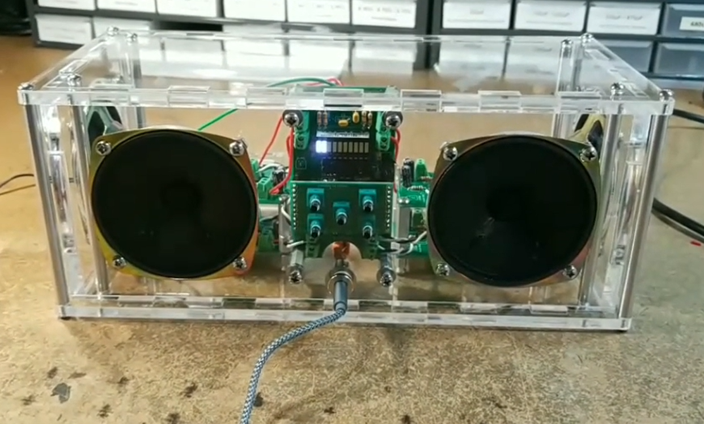
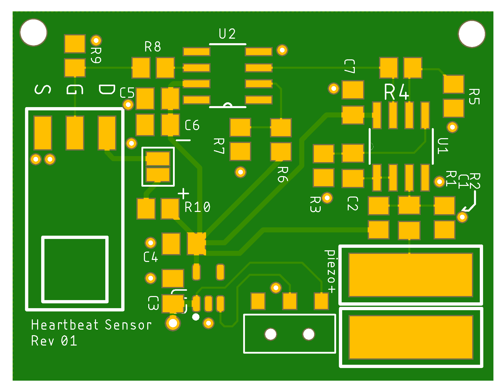

# PROJECTS
### [Analog PWM fan controller](/projects/analog-PWM-gen/)

Using ICs to make a square wave generator, integrator, and comparator, capable of producing a 20 kHz PWM signal suitable for communicating with a PC fan. Built on cheap Chinese breadboards, but functional for blowing solder smoke away from my face.

### [Boombox](/projects/boombox/)

A personal boombox made with LM386 audio amps, MAX5456 logarithmic digipots, and a custom laser-cut acrylic enclosure.

### [Heartbeat Sensor](/projects/hrsense/)

A "wearable" intended to flash a high power IR LED in tandem with my pulse. Detection with a piezo pickup, amplification/filtering with various ICs, built onto a compact PCB. Processing of pulse done with a modded webcam and OpenCV (work in progress)
