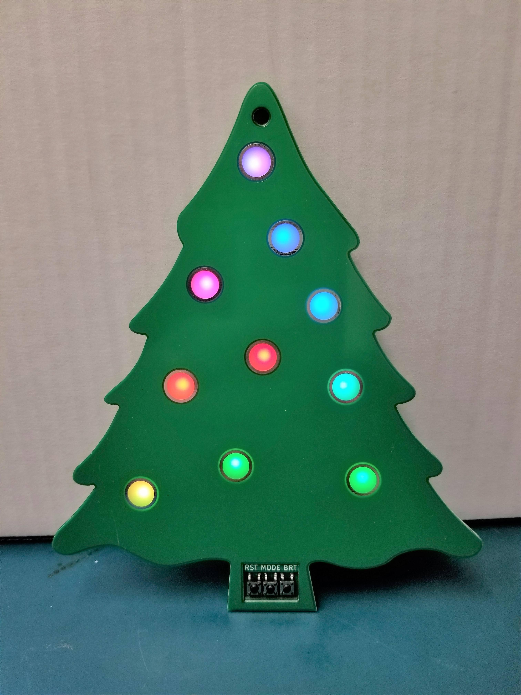

# PROJECTS

### [Wireless Power Transfer Over PCB Trace Coils](/projects/WPT/)

Custom implementation of resonant wireless power transfer over coils formed from PCB traces. TX side uses H-bridge with gate drivers, driven by STM32F070F6. RX side includes LEDs, hall sensor, temp sensor, etc. and is controlled by STM32G031C6.

### [Oreo Ornament](/projects/tree/)

A Christmas ornament built out of a 3-layer stack of PCBs. Uses serially addressable RGB LEDs to light up copper cutouts on the front panel. Run on an STM32F030F4.

### [Boombox](/projects/boombox/)

A personal boombox made with LM386 audio amps, MAX5456 logarithmic digipots, and a custom laser-cut acrylic enclosure. Also features a LED bar graph VU meter, and some nice lil buttons.

### [Heartbeat Sensor](/projects/hrsense/)

A "wearable" intended to flash a high power IR LED in tandem with my pulse. Detection with a piezo, amplification/filtering with various ICs, built onto a compact PCB. Processing of pulse done with a modded webcam and OpenCV.

### [Analog PWM Fan Controller](/projects/analog-PWM-gen/)

Using ICs to make a square wave generator, integrator, and comparator, capable of producing a 20 kHz PWM signal suitable for communicating with a PC fan. Built on cheap, low-quality breadboards, but functional for blowing solder smoke away from my face.
