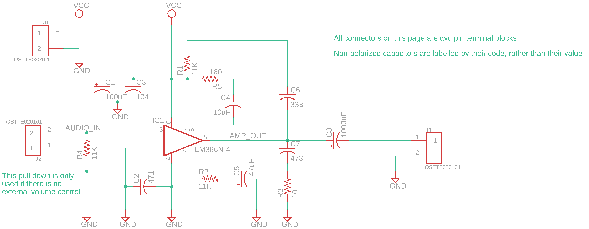
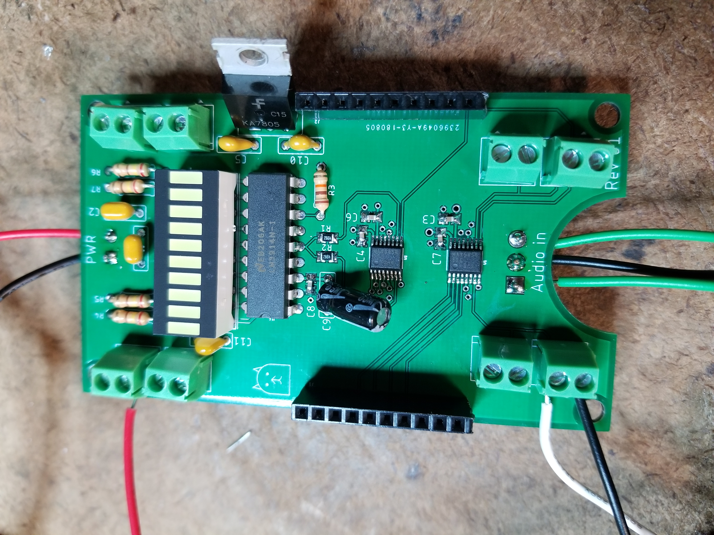
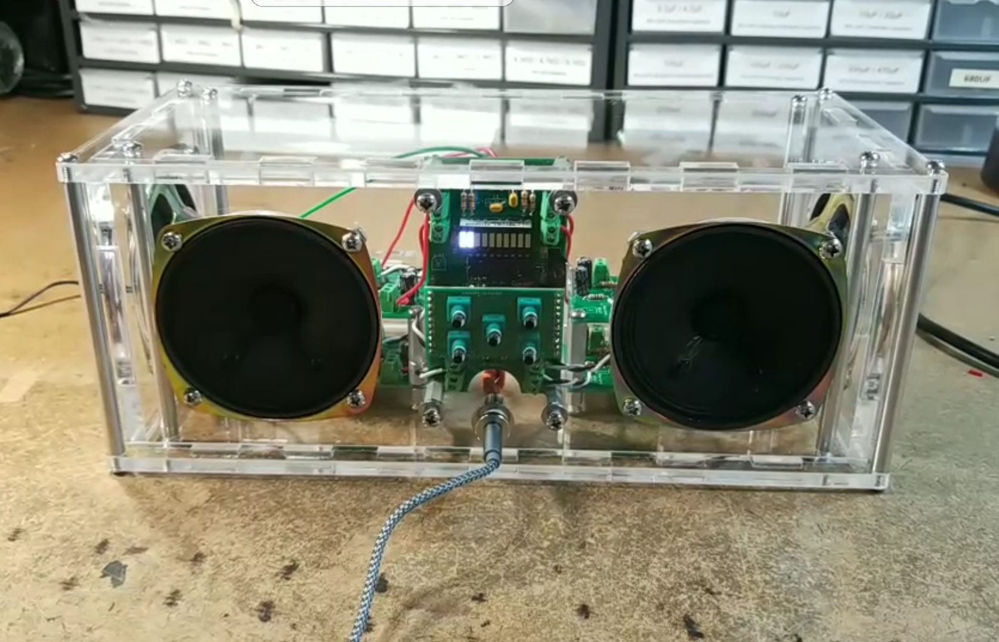
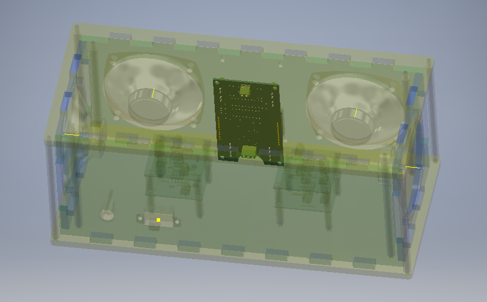

---
layout: default
title: pi-clock
---

# A Modular Raspberry Pi Clock

### Motivation 

As a US-based engineer, one of the major inconveniences of working with fabs/vendors in Asia, whether for personal or professional projects, is that the feedback loop is usually artificially constrained to one iteration per day. Assuming one can get their design files uploaded by late afternoon Pacific time, vendors in Asia will usually reply sometime between 1-5 AM. My original motivation for this project was to develop an alarm clock that could trigger an alarm whenever I received a middle-of-the-night DFM update from a fab vendor. Putting aside the question of whether it's completely inane of me to *want* to be woken up to respond to these emails, I figured this would be a fun opportunity to work with an SBC (Raspberry Pi), since most of my personal projects have either been analog or implemented using microcontrollers. Because I'm constantly pushing feature creep on my personal projects, I also decided to design this alarm clock with a modular hardware architecture, so that in the future I could add/remove features at will.

### High-level Architecture

#### Hardware
At a basic level, an alarm clock needs to be able to know the current time, show that time, play an alarm, and have a means of setting/canceling alarms. For my particular use case, the clock also needed Wifi connectivity and enough smarts to somehow be aware of emails and their content. While it could be possible to implement this on something like an ESP32, I felt an SBC would be a far easier path. Since the amount of compute required is quite low, I chose the Raspberry Pi Zero W, which offered a small form factor with Wifi connectivity. 

In the interest of modularity (and aesthetics) I decided that each of the "feature" cards would follow the same x-y dimensions as the Pi, so that they could all be lined up in a row. Each card borrowed the same IO header footprint as the Pi, with a right-angle header. The Pi and all of the cards were designed to plug into a base plate that connects all of the IO in parallel, so that the Pi/cards could be interchangeably swapped into any of the base plate slots. While this isn't great for signal integrity or EMI, the highest speed interface in this design is I2S and routing length is relatively short - plus I'm not trying to pass FCC certification. 

My initial design consisted of 3 feature cards in addition to the Pi and the baseplate:
1. Display/button: featuring 4 7-segment displays to show the time, and 4 buttons to provide a user interface for setting alarms, snoozing, etc.
2. Audio output: uses an I2S DAC and two class AB amplifiers to drive two speakers
3. Power conditioning: a supercapacitor backup circuit that allows the Pi to gracefully shut down in the event of a power outage

#### Software
The software for this clock is relatively simple. The code is all written in Python, split into modules:
DIAGRAM HERE

Most of these drivers are relatively trivial. The one unique feature worth explaining is the actual email scanning, which is a bit hacky. For this, 

### Feature Cards

#### Power Conditioning

The button boards are connected to the MAX5456 chip, which is a digital potentiometer actually specifically designed for use with audio. It has a logarithmic taper, as opposed to linear, which means that the volume adjustment is much more intuitive for hearing (the human ear works logarithmically). In addition, it has a mute button, and balance function (to shift the sound distribution from side-to-side). Unlike many other digipots, the MAX5456 (and 5457) is incremented not through SPI or I2C, but through a push button interface. It even includes automatic debouncing! All in all, it's fantastic for volume control applications. 

The MAX5456 is actually the first chip I've had to put on a board without first testing its function (the package is a QSSOP, which I couldn't find a breakout board for). Needless to say, I was extremely excited when it first worked.

<video width="320" height="240" controls>
  <source src="../../assets/VolumeTest.mp4" type="video/mp4">
Your browser does not support the video tag.
</video>
 

#### Audio

I knew from the beginning of this project that I wanted some indicator of volume. One naive solution would be to just connect the LM3914 (LED bar graph driver) directly to one of the audio out lines. However this would a) give a wildly variable volume level b) only represent one channel, which would be inaccurate when using the balance function and c) load the audio line, with potential impact on volume/quality. Instead, I added *another* MAX5456 chip, hooked up to the same button controls, and instead fed it a constant voltage level. This way, the output would literally just be voltage divided down, giving a good input to the LED bar graph driver, which is essentially a ladder of comparators. In order to overcome the balance issue, I connected the left and right outputs, which has the effect of averaging the two voltages. This was a somewhat nerve-racking design choice, given that I had only ordered 3 of the chip, but I was able to assemble the board without needing the spare.

One thing I will note is that the LM3914 uses a linear sweep of comparators to determine which LEDs to drive, whereas my volume control unit is logarithmic. This does mean that there isn't a 1-to-1 correspondance between button presses and LED bars lighting up. I've ordered some LM3915 (identical, except logarithmic) and plan to swap the chips. The visible meter is a 10-segment white LED bar graph. For any details about the setup, you can consult the [schematic](https://andrewge.me/assets/VolumeBoard_schematic_V1.pdf) I made. There were a few last minute adjustments. The 10 uF bulk caps were switched to 4.7uF because those were the largest ceramics I had. I accidentally used the ceramic cap footprint for the 10uF power supply decoupling cap, so I squeezed in an electrolytic instead. Finally, a few of the SMD passives are 0603 packages instead of 0805. You might notice that I have a mix of SMD and THD parts. That's primarily due to part availability. In an ideal world, I would only use SMD, but since I had to buy each individual SMD part value I was looking for, and several of my ICs were through hole anyways, I opted to only use SMD for the more sensitive, space-constrained parts (e.g. the audio handling). 

#### Display/Buttons

### Bringing It All Together

From the beginning of this project, I had already decided that I wanted the project to be visually interesting, and to me, that meant being able to see the internals of the boombox. That immediately narrowed down my options for materials to glass and clear plastic, and acrylic was the obvious winner with respect to cost, ease of fabrication, and material properties. 

In the past, I've tried to make enclosures with 3d printing (which was too slow, prone to errors, and likely to warp when cooling), as well as laser cut plates, hot glued together (had weak joints and poor aesthetics). This time, I decided to make an enclosure that required minimal assembly and would also look good. I chose clear acrylic, and designed an enclosure that conceivably could be held together with a single standoff (though I used 8 for strength and symmetry). 

The first step in my design process was to actually model all of the parts that would be going into the enclosure, as I didn't want to end up with an enclosure that didn't fit all the boards. Some parts, like the momentary buttons, were relatively easy to model, whereas others, like the speakers, were comparatively harder. Thankfully, Eagle has a new feature that allows exporting boards into Fusion360, from which it was simple to move the models to Inventor. In the past I've tried just guesstimating how big an enclosure needs to be, which inevitably leads to either cramped components or wasted material: having a good 3d model made a world of difference, and I'll definitely go this route in the future. I did a few test cuts on scrap material to check if the parts fit as expected (the speakers in particular I was unsure of), and surprisingly everything checked out! With all parts modelled, designing the enclosure was simply a matter of placing the boards and speakers, figuring out the wall sizes needed, and adding cutouts. The walls of the enclosure are cut to fit into each other, and have tabs on the top and bottom that slot into the corresponding plates. 

 
As a segue, I love laser cutting as a method of producing enclosures/fixtures. While 3d printing allows for complex shapes and minimizes external hardware, laser cutting is orders of magnitude faster, requires no consideration for shrinkage/warping/liftoff/etc. (at least for hobbyist level extruded 3d printers, this has been a consistent problem), and is stunningly accurate. Out of curiosity, I designed my tabs with almost no clearance, and was amazed to find that everything still fit together. Here's a picture of the final assembly in CAD and in reality.

### Lessons Learned
* For personal projects, avoid closed-source software unless you're confident you'll always have access to it
* When a part isn't working and the schematic looks clean, double check the part number and datasheet before you spend several days debugging
* Even for devices that will eventually target a Pi in headless mode, it may be worthwhile to start in default, to avoid SCPing files every 5 minutes
