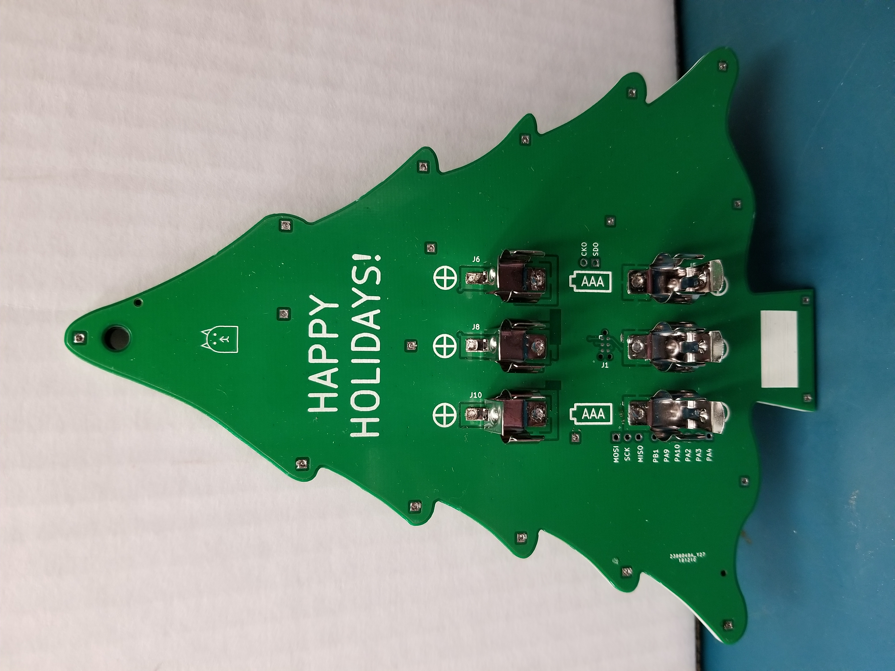
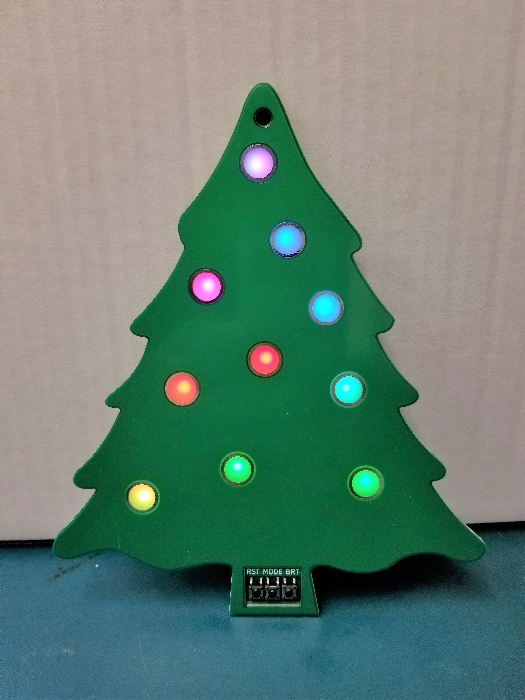
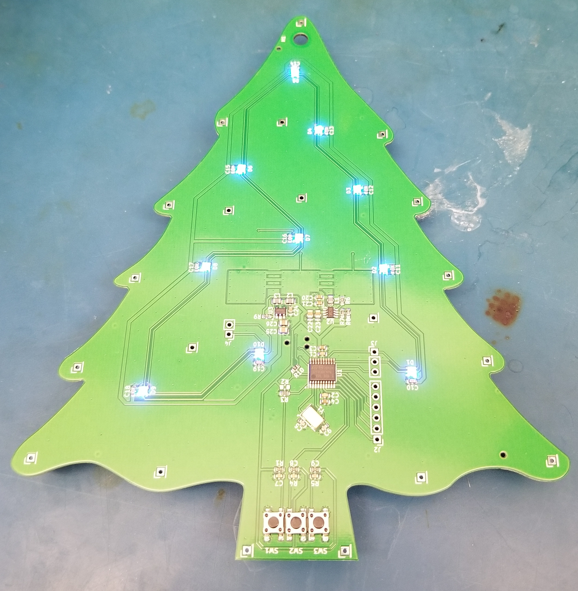
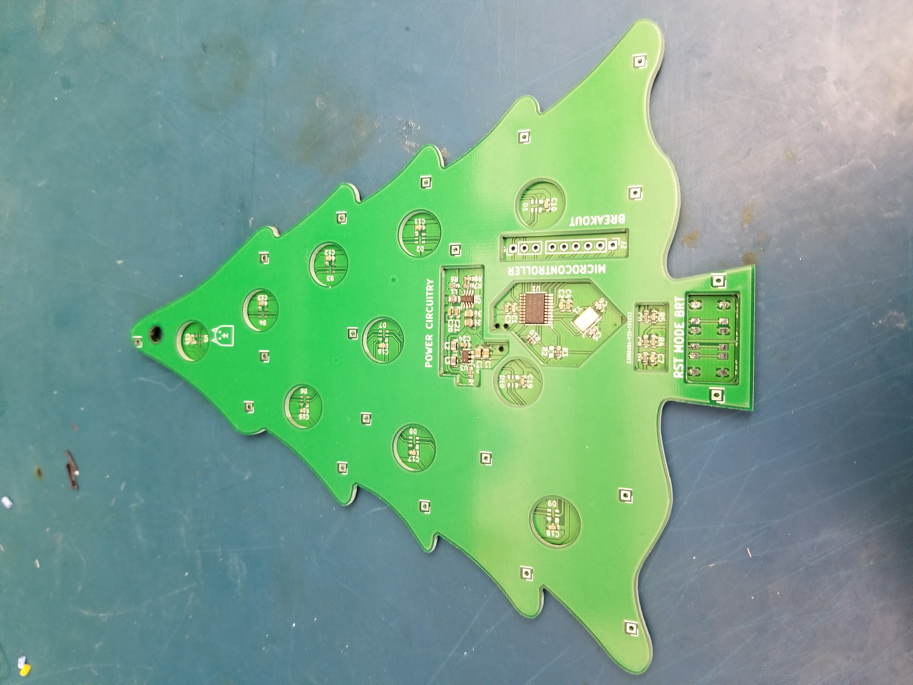
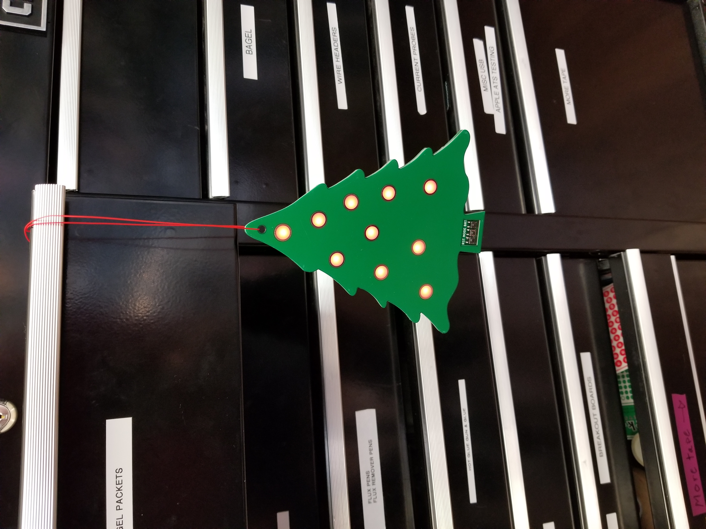

# PCB Christmas Ornament

### Motivation

Just short of a year ago, I read an [article](https://hackaday.com/2019/01/18/oreo-construction-hiding-your-components-inside-the-pcb/) on hackaday about the art of hiding components inside of a multilayer PCB stack. I immediately was convinced that I had to try this at some point, as I personally love the aesthetics of having PCBs visible in products, and figured this method, termed Oreo construction by the article’s author, could easily lead toward having a PCB be the entire product. Sometime around the end of the summer, I started thinking about making some PCB ornaments for friends and family and realized this could be the perfect chance to try out this technique! I decided to make the ornaments in a Christmas tree form factor, and thus my Christmas tree PCB (which I’m calling the Oreo ornament, after the construction method used), was born!

<video width="500" controls muted>
  <source src="../../assets/OrnamentInTreeVideo.mp4" type="video/mp4">
Your browser does not support the video tag.
</video> 

### Construction

The Oreo ornament is composed of a stack of 3 PCBs.

The base layer (1mm thick) has all of the components on it. It uses 10 serially addressable RGB LEDs (APA102s, often called [Dotstars](https://www.adafruit.com/product/3587)), controlled by an STM32 F030F4. It has clips for 3 parallel AAA batteries on its back and boosts the battery voltage up to 3.3V for the microcontroller and 5V for the LEDs. There are 3 buttons exposed to the user that reset the microcontroller, change the LED mode (see below), and adjust the brightness. Other than the buttons, battery clips, and a few breakout pins for the microcontroller, all of the components are hidden from view. Here’s the [schematic](https://andrewge.me/assets/Christmas_Tree_Schematic.pdf) in pdf form.

The cutout layer (1.6mm thick) has internal cutouts that surround all of the components, including 10 circular cutouts for the LEDs.

The front panel layer (1mm thick) has circular “ornament” areas corresponding to the LED cutouts, with soldermask and copper removed so that the LEDs can shine through. This method of diffusing the LEDs’ light is often used in PCB [badges](https://hackaday.com/2019/04/17/the-science-of-reverse-mounted-leds/) with reverse mount LEDs, or sometimes in PCB based [enclosures](https://hackaday.com/2019/09/16/the-benefits-and-pitfalls-of-using-pcbs-as-an-enclosure/).

The three layers are bonded together using a system of stacked THT and SMT pads, which you can see in the above pictures – no mechanical parts necessary! I simply placed solder paste on the SMT pads of one board, stacked the next layer on top with corresponding THT pads, and shoved a fine tip iron into the via.

### Modes

I wrote code ([Github repo](https://github.com/andrewge8622/OreoOrnament)) for a few different display modes, but here’s a brief description:

    Statically displays red and gold ornaments (I figured these were the most common Christmas ornament colors).
    Breathes all red ornaments (I’ve found that breathing animations are quite popular).
    Breathes all gold ornaments.
    Breathes red and gold ornaments.
    Alternates from blue->green->red, switching every few seconds. I originally just had this as a test mode to confirm that all 3 LED channels were working but ended up liking it enough to keep it.
    Uses the HSV color model to slowly fade LEDs between all colors (hues). This is by far my favorite display mode, as I find it really relaxing to watch as the colors slowly shift from LED to LED. I got the idea to fade using HSV from [this](https://hackaday.com/2018/06/18/buttery-smooth-fades-with-the-power-of-hsv/) post, and borrowed its HSV->RGB conversion code as well.

The brightness in each mode can also be adjusted, which is done via the global brightness register of the APA102s. I’m adjusting brightness linearly though, which doesn’t work as well with the breathing patterns as human brightness perception is definitively non-linear. I’m no firmware engineer, and the code definitely doesn’t follow great design practices, but I’m pretty happy with how the overall project functions.

<video width="500" controls muted>
  <source src="../../assets/AllTreesOn.mp4" type="video/mp4">
Your browser does not support the video tag.
</video> 

### Challenges

I spent seemingly countless hours working on this project, yet just barely finished it in time for Christmas. There were a lot of steps along the way that I didn’t expect. One of the immediate issues I ran into wasn’t even electrical in nature but ended up taking me quite a while to solve. I drew up the board outline in Autodesk Inventor, tracing over a clipart of a Christmas tree that I liked. After exporting the face as a DXF, I tried importing into both Eagle and KiCad, both of which resulted in very exploded, unusable board outlines filled with myriad issues. I tried a workaround where I imported an STL from Inventor into FreeCAD, then exported a 2D view of that into KiCad. While after this, the board outline looked correct, there were evidently pretty major issues with the import, where the imported DXF contained hundreds or thousands of line segments that overlapped each other. Since KiCad expects a single closed outline to be formed, these “fragments” prevented proper generation of the board outline! I ended up writing a Python script that would take the existing KiCad board outline and delete all of the fragments that weren’t a part of the “true” outline, a time-consuming endeavor that required me to flex a part of my brain I hadn’t used since my college algorithms course. In the future, I’ll probably just opt for simpler board outlines.

Once I actually had a board outline, I agonized over what features to include (classic scope creep) – at various points, I had planned on having a separate base station PCB that used a wall wart, having programming buttons off of the PCB, various switches, and more. Ultimately, I settled on a relatively simple, standalone design. Unfortunately, by the time I really locked in the features I had little time to do the actual design, assembly, firmware, and bringup.

In order to cut down on assembly time, I opted to have my base PCB mostly assembled by JLCPCB’s SMT service. This, however, meant that I had to limit my design to parts that were in their assembly library. While I had to make some interesting design tradeoffs (using a sketchy Chinese boost converter IC, stringing together series power inductors because none of the ones available had a high enough inductance, etc.) there was no way I would have been able to hand assemble the number of ornaments I ultimately made (16!) Even with the assembly service, I did have to hand assemble the APA102 LEDs, the buttons, and the AAA battery clips, a process that required getting a custom stencil with cutouts for the pre-assembled parts, and still took around an hour per board. I used the 2020 version of the APA102s (2mm on each side!), which had miniscule pads with a propensity for either shorting together or not soldering properly – reworking these was a pain, to say the least.

This project was also my first time writing firmware for an STM32, which was a big challenge for me. While using CubeMX was in some ways a huge time saver, it also caused a lot of frustration, including one instance where it deleted all of the source code I had written thus far (painful lesson learned: use version control). I also faced issues with the non-form factor prototypes I was using, caused by a combination of software (improperly implemented LED driver code, accidental deletion of interrupt drivers) and hardware issues.

<video width="500" controls muted>
  <source src="../../assets/flickering.mp4" type="video/mp4">
Your browser does not support the video tag.
</video> 

However, by December 20th I finally had the code in a workable (though far from final) state!

<video width="500" controls muted>
  <source src="../../assets/FirstTest.mp4" type="video/mp4">
Your browser does not support the video tag.
</video> 

The next night, I was finally able to put together my first fully functional Oreo ornament!

### Conclusion

Overall, I had a ton of fun working on this project, and was really excited to get to try several different things that I’ve wanted to do for a while (Oreo construction, using a PCB as a light diffuser, JLCPCB’s assembly service, writing firmware for the STM32). But the most rewarding part was actually handing out these ornaments to friends, family, and coworkers. I got a really positive response, that made all of the late nights in the lab more than worth it.
